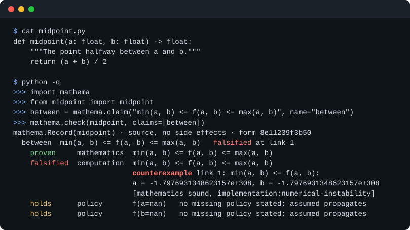

# mathema

Proofs and counterexamples for Python functions, kept as records bound to the exact code they were checked against.

[](https://pypi.org/project/mathema/)
[](https://pypi.org/project/mathema/)
[](https://github.com/tetrionlabs/mathema/actions/workflows/tests.yml)
[](https://github.com/tetrionlabs/mathema/blob/main/LICENSING.md)
[](https://mathema.tetrionlabs.com/)



mathema checks Python functions against claims, short mathematical statements of what a function is meant to do, and keeps each result as a record bound to the code. It proves a claim over its whole domain where the body reads as mathematics, and elsewhere runs the real function on inputs chosen to break it, keeping evidence and proof apart. The name is Greek, μάθημα, that which is learned.

## Highlights

- Proofs over a whole domain, not a sample of it: the function body is lifted to a symbolic expression and the claim decided in exact real arithmetic, with an opt-in z3 step for nonlinear inequalities.
- Inputs that break code are searched for directly (poles, domain corners, the largest double, empty and degenerate containers), and every falsification carries a counterexample that was executed against the real function.
- A bare `mathema.check(fn)` runs a battery of built-in claims, so a first audit needs no claim written at all.
- Each claim is judged twice, once over the reals and once in float64, and when the computation misses, the record names the condition number and says whether the inputs or the code lost the precision.
- Functions that call [numpy](https://mathema.tetrionlabs.com/runtime-types/#proofs-on-pandas-and-numpy-code), [pandas](https://mathema.tetrionlabs.com/pandas-function/) or [polars](https://mathema.tetrionlabs.com/runtime-types/#the-built-in-runtime-types) are checked through [bundled claims about those libraries](https://mathema.tetrionlabs.com/library-claims/), and parameters annotated as a `Series` or `DataFrame` are run on real ones.
- Records are bound to the code by a hash of its form, so `mathema verify` re-checks a function when it or anything it calls changes, and a claim that held before and fails now is reported as `invalidated`.
- CI gets distinct exit codes, GitHub Actions and JUnit output, a claim-level diff of a pull request (`mathema review`) and a population report over a package (`mathema audit`).
- Coding agents connect through an MCP server and agent skills, and can propose and check claims while accepting a verdict stays with a person.
- Claims about strings and structured records take their domains from the mathema-language package.

When mathema cannot settle a claim it says `unknown` and records why, rather than reporting a pass.

## Install

```bash
pip install "mathema[all]"
pip install mathema
```

The first adds numpy, z3, the MCP server, the coverage reader and mathema-language; the second is the core alone, which needs only sympy and pyyaml. mathema supports Python 3.10 to 3.14 and runs offline, with no account or API key.

## Quick start

<!-- example: quick run -->
```python
import mathema

def discounted(price: float, rate: float) -> float:
    """The price after applying a discount rate."""
    return price * (1 - rate)

print(mathema.check(discounted, claims=[
    mathema.claim("for rate in [0, 1], f(price, rate) <= price",
                  name="at_most_price"),
    mathema.claim("for price in [0, 1e6], rate in [0, 1], f(price, rate) <= price",
                  name="at_most_price_when_positive"),
]))
```

<!-- example: quick output match=subset wrap=88 -->
```text
mathema.Record(discounted) · source, no side effects · form d2ab6eef1b84
  at_most_price  for rate in [0.0, 1.0] : float|missing, f(price, rate) <= price
      falsified at price = -1, rate = 1
    falsified  computation  for rate in [0.0, 1.0] : float, f(price, rate) <= price
        counterexample price = -1, rate = 1
                            [mathematics unsound, blame claim]
  at_most_price_when_positive  for price in [0.0, 1000000.0] : float|missing, rate in
      [0.0, 1.0] : float|missing, f(price, rate) <= price   holds
    proven     mathematics  for price in [0.0, 1000000.0] ⊂ ℝ, rate in [0.0, 1.0] ⊂ ℝ,
        f(price, rate) <= price
    holds      computation  for price in [0.0, 1000000.0] : float, rate in [0.0, 1.0] :
        float, f(price, rate) <= price   49 draws
```

The first claim never said prices are positive, and a negative price discounted by the whole rate breaks it. The second states the domain, and its `mathematics` line is proven for every price and rate in range. The `computation` line runs the same claim through float64 and holds on every draw, which is evidence rather than proof, so the headline reports `holds`.

## A tour

### Proving

<!-- example: parity file=options.py -->
```python
import math

def put_call_parity_gap(s: float, k: float, r: float, t: float,
                        sigma: float) -> float:
    """A European call minus a European put on the same strike."""
    root_t = math.sqrt(t)
    d1 = (math.log(s / k) + (r + 0.5 * sigma * sigma) * t) / (sigma * root_t)
    d2 = d1 - sigma * root_t
    phi = lambda z: 0.5 * (1.0 + math.erf(z / math.sqrt(2.0)))
    call = s * phi(d1) - k * math.exp(-r * t) * phi(d2)
    put = k * math.exp(-r * t) * phi(-d2) - s * phi(-d1)
    return call - put
```

The code prices a call and a put through logarithms, square roots and the normal distribution, yet their difference should always be `s - k*exp(-r*t)`, with volatility dropping out entirely. That is put-call parity, and the claim states it over realistic ranges:

<!-- example: parity run -->
```bash
mathema check options.py --claim "for s in [50,150], k in [50,150], \
    r in [0.0,0.1], t in [0.1,2], sigma in [0.05,0.8], \
    f(s,k,r,t,sigma) == s - k*exp(-r*t)"
```

<!-- example: parity output -->
```text
ok   options.put_call_parity_gap: source, no side effects; claims 7/7 checked (1 proven, 6 holds, 0 falsified)
```

mathema lifted the body to an expression in which both Gaussian terms cancel and `sigma` drops out, so the identity is proven over the whole region. The six that hold are the same identity run in float64 and five rows recording what the function does with a `nan` in each parameter. [The derive route](https://mathema.tetrionlabs.com/derive-route/) lists what can be lifted and how each proof is named.

### Falsifying

With no claim written, only the built-in claims apply:

<!-- example: pole run -->
```python
import mathema

def discount_factor(x: float) -> float:
    """A discount factor that divides by one minus the rate."""
    return 1 / (1 - x)

print(mathema.check(discount_factor))
```

<!-- example: pole output match=subset -->
```text
mathema.Record(discount_factor) · source, no side effects · form ebb4c9b87847
  proven    is_defined: 1 - x != 0
  falsified is_pole_safe[x]: is_pole_safe(x)
           counterexample x = 1 is admitted by the declared domain but sits at or beside a pole: the call raised ZeroDivisionError
```

These are two of fourteen rows. Uniform sampling over the reals lands on `x = 1` with probability zero, so mathema solves the lifted expression for where the denominator vanishes and makes sure that point is tried. [See what mathema finds](https://mathema.tetrionlabs.com/findings/) has more.

### The mathematics and the computation

A proof is about real numbers, and whether float64 keeps up is a separate question with its own verdict:

<!-- example: step run -->
```python
import mathema

def step(x: float) -> float:
    """The distance from x to x + 1."""
    return (x + 1.0) - x

print(mathema.check(step, claims=[
    mathema.claim("for x in [0, 1e16], f(x) == 1", name="unit_step")]))
```

<!-- example: step output -->
```text
mathema.Record(step) · source, no side effects · form 8ca9c721c4cf
  unit_step  for x in [0.0, 1e+16] : float|missing, f(x) = 1   falsified at x = 1e+16
    proven     mathematics  for x in [0.0, 1e+16] ⊂ ℝ, f(x) = 1
    falsified  computation  for x in [0.0, 1e+16] : float, f(x) = 1   counterexample x = 1e+16
                            [mathematics sound, implementation:numerical-instability]
                            f loses more than the conditioning explains (κ ≈ 0, error 1)
                            possible fixes:
                              if the loss is accepted, run: mathema accept step unit_step --as discovery
    holds      policy       f(nan)   no missing policy stated; assumed propagates
```

At `1e16` the spacing between doubles is 2, so `x + 1.0` rounds back to `x` and the function returns 0.0. A condition number near zero says the exact problem is well conditioned, so the precision was lost by the code and not by the inputs, and the record offers the command that accepts the loss if it is in scope. [Guarantees](https://mathema.tetrionlabs.com/guarantees/#mathematics-and-computation) sets out what each line establishes.

### Library code

<!-- example: pandas file=returns.py -->
```python
import pandas as pd

def average_return(returns: pd.Series) -> float:
    """The mean of a series of periodic returns."""
    return float(returns.mean())
```

<!-- example: pandas run requires=pandas -->
```python
import mathema
from returns import average_return

record = mathema.check(average_return, claims=[mathema.claim(
    "for returns in [-0.1, 0.1]^n \\ {missing}, assuming dim(returns) >= 1, "
    "min(returns) <= f(returns) <= max(returns)", name="between")])
proof = record.probes[0]
print(proof.verdict, proof.route)
print(proof.sketch.split("; link 2")[0])
```

<!-- example: pandas output wrap=88 -->
```text
proven derive
link 1: min(returns) <= f(returns): taking pandas.Series.mean as mean(a) (axiom, bundled
    with mathema, pandas 2.2 to 3.x); through the pandas.Series.mean definition row,
    read as sums over returns at a symbolic length: the relation holds for every length
    of at least one (min(returns) is at most mean(returns))
```

The proof goes through the bundled definition row for `pandas.Series.mean`, and the probe hands the function a real `Series`. `mathema compendium status` lists which library calls in a project have rows and which are a black box, as [library claims](https://mathema.tetrionlabs.com/library-claims/) shows.

### Knowledge that goes stale

<!-- example: stale file=rates.py -->
```python
def rate_for(years: int) -> float:
    """The loyalty discount for a customer of this many years."""
    return 0.05 * years
```

<!-- example: stale file=pricing.py -->
```python
from rates import rate_for

def discounted(price: float, years: int) -> float:
    """The price after the customer's loyalty discount.

    Claims:
        never_raises: for price in [0, 1e6], years in [0, 10] subset Z, f(price, years) <= price
    """
    return price * (1 - rate_for(years))
```

<!-- example: stale run -->
```python
import mathema, pricing, rates

mathema.write_spec(rates.rate_for)
mathema.write_spec(pricing.discounted)
```

`write_spec` writes each record under `.mathema/verified/` with hashes of the code's form and signature and of what it calls. Then someone changes the helper and nothing else:

<!-- example: stale file=rates.py -->
```python
def rate_for(years: int) -> float:
    """The loyalty discount, counted from the second year."""
    return 0.05 * (years - 1)
```

<!-- example: stale session -->
```
$ mathema verify; echo "exit $?"
FAIL pricing.discounted: dependency changed; 1 proven, 1 holds, 0 falsified, 1 invalidated  <- 1 invalidated claim(s)
ok   rates.rate_for: form changed; 1 proven, 0 holds, 0 falsified
0 unchanged since the last run (not run again), 2 checked, 1 problem(s)
grammars detected: mathema; verified by this run: mathema
exit 1
```

`discounted` did not change, but a new customer now gets a negative rate and the claim that held is `invalidated`, so `verify` exits 1. [mathema verify](https://mathema.tetrionlabs.com/modes/verify/) covers the rest.

### CI and review

```bash
mathema init --ci github           # scaffold the workflow step
mathema verify                     # 0 clean, 1 a finding, 2 could not run
mathema check src --format github  # inline annotations on the pull request
mathema review origin/develop      # what the change did to what is known
mathema audit src                  # every function: claimed, pure, liftable, tested
```

`review` reads the verified store as claims rather than YAML, so a flip from `holds` to `falsified` is one line, and `--format json` gives a pipeline something to post. Accepting a verdict (`mathema accept`), locking a function's form and the integrity checksum are covered in [governance](https://mathema.tetrionlabs.com/governance/), and [gate a pipeline](https://mathema.tetrionlabs.com/gate-a-pipeline/) walks through a first red run.

### Coding agents

`mathema mcp serve` exposes the same machinery as MCP tools over stdio, including adjudication, the CI sweep, a claim linter (`parse_claim`) and the queue of decisions waiting on a person. An agent can lock a function but not unlock one, and nothing it does accepts a verdict. `mathema init --agents` vendors skills for [Claude Code](https://mathema.tetrionlabs.com/agent-setup/#3-vendor-the-skills), [Codex](https://mathema.tetrionlabs.com/agent-setup/#3-vendor-the-skills), [Gemini](https://mathema.tetrionlabs.com/agent-setup/#3-vendor-the-skills), [Cursor](https://mathema.tetrionlabs.com/agent-setup/#3-vendor-the-skills), [Copilot](https://mathema.tetrionlabs.com/agent-setup/#3-vendor-the-skills) and other coding agents, and is the one command that fetches anything. See [working with coding agents](https://mathema.tetrionlabs.com/agents/) and [set up mathema for an agent](https://mathema.tetrionlabs.com/agent-setup/).

### Text and records

With mathema-language installed, a domain can be a language of strings or a schema of records, and the probe visits each language's hazards (the empty string, control characters, a byte-order mark, a lone surrogate) before drawing at random:

```
for s in L[unicode], f(f(s)) == f(s)
for s in L[unicode], len(f(s)) <= len(s)
for s in L[unicode], "<" not in f(s)
```

Without the package such a claim is `unknown` and names what it needs. [Language domains](https://mathema.tetrionlabs.com/language/) has the details.

## How it compares

mathema sits beside these tools rather than replacing them, and each answers a question it does not.

| Category | What it establishes | Over which inputs | What mathema adds |
|---|---|---|---|
| Unit tests | the outputs for cases someone chose | the chosen cases | a claim over a stated domain, proven or searched |
| Property-based testing | a property survives random and shrunk inputs | a random sample | proof where the body lifts, and poles, corners and degenerate inputs that sampling rarely hits |
| Type checkers | values have the declared types | every input, at the level of types | statements about values, not only their types |
| Linters and static analysis | known bug patterns are absent | every path, by pattern | the function's own intended behaviour, checked by running or proving it |
| Formal verification and proof assistants | a full specification, machine-checked | every input, under a proof someone writes | proofs found automatically for a narrower class of code, and labelled evidence where proof is out of reach |
| LLM code review | a model's reading of the diff | none in particular | verdicts from mathematics or execution with no model in the loop, kept as records |

A type checker and a test suite remain worth running; mathema is narrower than a proof assistant and makes no claim about whole programs.

## Documentation

The [documentation](https://mathema.tetrionlabs.com/) has a [reading order for each job](https://mathema.tetrionlabs.com/start/), the [quick start](https://mathema.tetrionlabs.com/quickstart/), [case studies](https://mathema.tetrionlabs.com/case-studies/), [the claim grammar](https://mathema.tetrionlabs.com/grammar/), [verdicts and exit codes](https://mathema.tetrionlabs.com/verdicts/) and the [command reference](https://mathema.tetrionlabs.com/modes/check/). mathema is pre-1.0: its claim grammar and record format are fixed by the [claim-driven development](https://github.com/aaronbyrnephd/claim-driven-development) specification, and its Python API may still change, as [stability](https://mathema.tetrionlabs.com/stability/) sets out. Releases are in the [CHANGELOG](https://github.com/tetrionlabs/mathema/blob/main/CHANGELOG.md).

## Contributing

Issues and pull requests are welcome; [CONTRIBUTING.md](https://github.com/tetrionlabs/mathema/blob/main/CONTRIBUTING.md) covers the process and the contributor agreement, [SECURITY.md](https://github.com/tetrionlabs/mathema/blob/main/SECURITY.md) how to report a vulnerability, and [SUPPORT.md](https://github.com/tetrionlabs/mathema/blob/main/SUPPORT.md) where to ask a question.

## Licence

mathema is source-available under the [Business Source License 1.1](https://github.com/tetrionlabs/mathema/blob/main/LICENSE.md), and each release converts to AGPL-3.0-or-later four years after it is published. [LICENSING.md](https://github.com/tetrionlabs/mathema/blob/main/LICENSING.md) sets out the grant in plain language.
